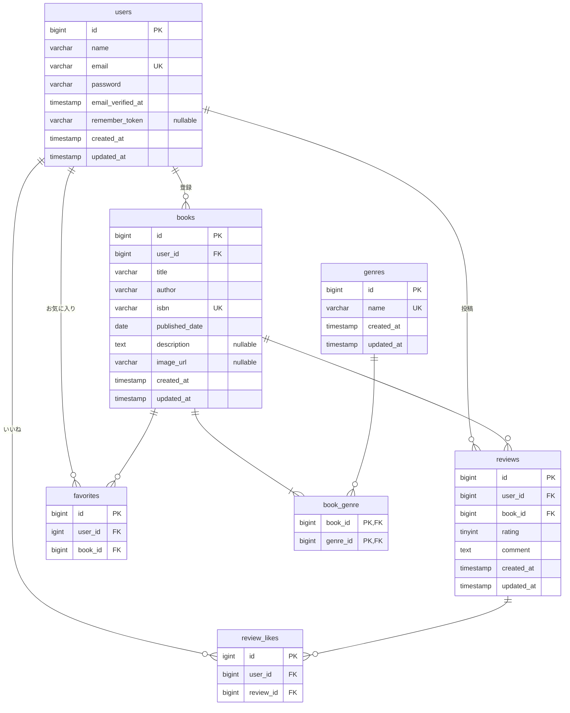

# 書籍レビューシステム（基本編）-　BookShelf

このリポジトリは、書籍レビューシステムの基本的な機能(CRUD、レビュー、お気に入り、いいね、ランキング)を実装したLaravelプロジェクトです。

## 動作環境

- Docker
- Docker Compose

※Windowsの場合はWSL2の利用を推奨しています。

> Apple Silicon (M1/M2) Mac をお使いの方は、`sail up -d` 実行時にプラットフォームエラーが発生する場合があります。その場合は compose.yaml の該当サービスに `platform: linux/amd64` を追加してください。

## 環境構築手順

1. **リポジトリをクローン**

   ```bash
   git clone https://github.com/yuki1959yuki-crypto/bookshelf-app.git
   cd bookshelf-app
   git checkout basic
   ```

2. **.envファイルの準備**

   `.env.example`をコピーして`.env`を作成します。

   ```bash
   cp .env.example .env
   ```

   `.env`ファイル内の以下のDB接続情報を確認・設定します。デフォルトではLaravel Sailの標準設定になっています。

   ```init
   DB_CONNECTION=mysql
   DB_HOST=mysql
   DB_PORT=3306
   DB_DATABASE=bookshelf
   DB_USERNAME=sail
   DB_PASSWORD=password
   ```

3. **Composer依存パッケージのインストール**

   プロジェクトの初回セットアップ時は、'vendor'ディレクトリが存在しないため'sail'コマンドを使用できません。
   以下のDockerコマンドを実行して、コンテナ内で'composer install'を実行します。
    
    ```bash
   　docker run --rm \
    -u "$(id -u):$(id -g)" \
    -v "$(pwd):/var/www/html" \
    -w /var/www/html \
    laravelsail/php82-composer:latest \
    composer install --ignore-platform-reqs
    ```

4. **Lalavel Sailの起動**

   以下のコマンドでDockerコンテナを起動します。

   ```bash
   ./vendor/bin/sail up -d
   ```

   > **エイリアスの設定(推奨)**
   >
   >毎回`./vendor/bin/sail`と入力するのは手間なので、エイリアスを設定すると便利です。
   >
   > ```bash
   > alias sail='[ -f sail ] && bash sail || bash vendor/bin/sail'
   > ```

5. **アプリケーションキーの生成**

   ```bash
    sail artisan key:generate
    ```

6. **データベースのマイグレーションと初期データ投入**
   
   以下のコマンドでテーブルを作成し、ダミーデータを投入します。

   ```bash
   sail artisan migrate:fresh --seed
   ```

7. **フロントエンドのビルド**

   ```bash
   sail npm install
   sail npm run dev
   ```

   `npm run dev`は開発中は起動したままにしてください。

8. **アプリケーションへのアクセス**

   ブラウザで[http://localhost](http://localhost)にアクセスします。

## 開発環境URL

- アプリケーション: http://localhost
- phpMyAdmin: http://localhost:8080

## テスト実行

```bash
sail artisan test
```

## API エンドポイント一覧

｜メソッド｜パス｜概要｜
｜--------｜----｜----｜
｜ GET ｜ `/api/v1/books` ｜書籍一覧取得 ｜
｜ GET ｜ `/api/v1/books/{id}` ｜書籍詳細取得｜
｜ POST ｜ `/api/v1/books` ｜書籍登録｜
｜ PUT ｜ `/api/v1/books/{id}` ｜書籍更新｜
｜ DELETE ｜`/api/v1/books/{id}`｜書籍削除｜

## 機能一覧

- ユーザー認証（登録、ログイン、ログアウト）
- 書籍のCRUD （登録、一覧、詳細、更新、削除）
- 書籍レビュー投稿・編集・削除
- お気に入り登録・解除
- レビューへのいいね登録・解除
- ランキング表示（レビュー平均評価 TOP10）
- 公開API（書籍 CRUD - RESTful JSON API）

## 仕様技術

- **PHP**:8.5
- **Laravel**:10.x
- **MySQL**:8.4
- **Docker / Laravel Sail**:開発環境コンテナ化
- **Tailwind CSS**:3.4.x（フロントエンドスタイリング）
- **Vite**:フロントエンドビルド
- **Laravel Fortify**:認証機能
- **phpMyAdmin**:DB管理ツール

## ER図



## 技術ドキュメント (Documentation)

* [画面遷移](docs/SCREEN-FLOW.md)
* [機能要件](docs/FRD.md)
* [データ要件](docs/DRD.md)
* [バリデーションルール仕様](docs/VALIDATION.md)
* [API設計](docs/API_DESIGN.md)
* [テスト](docs/TEST.md)


## 作成者

松永　有希
