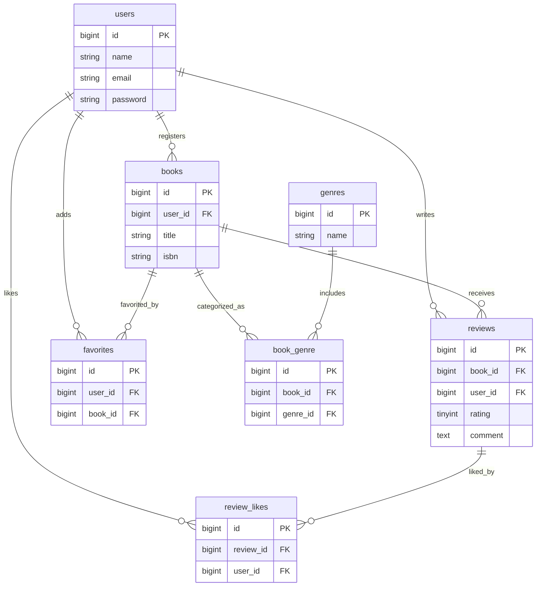

# データベース設計

## テーブル定義

### users

| カラム名 | 型 | PK | NN | FK | 備考 |
|----------|----|:--:|:--:|:--:|------|
| id | bigint unsigned | ○ | ○ | | `$table->id()` |
| name | varchar(255) | | ○ | | |
| email | varchar(255) | | ○ | | UNIQUE |
| password | varchar(255) | | ○ | | |
| created_at | timestamp | | | | |
| updated_at | timestamp | | | | |

---

### genres

| カラム名 | 型 | PK | NN | FK | 備考 |
|----------|----|:--:|:--:|:--:|------|
| id | bigint unsigned | ○ | ○ | | `$table->id()` |
| name | varchar(255) | | ○ | | UNIQUE |
| created_at | timestamp | | | | |
| updated_at | timestamp | | | | |

---

### books

| カラム名 | 型 | PK | NN | FK | 備考 |
|----------|----|:--:|:--:|:--:|------|
| id | bigint unsigned | ○ | ○ | | `$table->id()` |
| user_id | bigint unsigned | | ○ | ○ | `constrained()->onDelete('cascade')` |
| title | varchar(255) | | ○ | | |
| isbn | varchar(13) | | ○ | | UNIQUE |
| created_at | timestamp | | | | |
| updated_at | timestamp | | | | |

---

### book_genre

| カラム名 | 型 | PK | NN | FK | 備考 |
|----------|----|:--:|:--:|:--:|------|
| id | bigint unsigned | ○ | ○ | | `$table->id()` |
| book_id | bigint unsigned | | ○ | ○ | `constrained()->onDelete('cascade')` |
| genre_id | bigint unsigned | | ○ | ○ | `constrained()->onDelete('cascade')` |

**制約**

- `unique(['book_id', 'genre_id'])`

---

### reviews

| カラム名 | 型 | PK | NN | FK | 備考 |
|----------|----|:--:|:--:|:--:|------|
| id | bigint unsigned | ○ | ○ | | `$table->id()` |
| book_id | bigint unsigned | | ○ | ○ | `constrained()->onDelete('cascade')` |
| user_id | bigint unsigned | | ○ | ○ | `constrained()->onDelete('cascade')` |
| rating | tinyint unsigned | | ○ | | 1〜5 |
| comment | text | | ○ | | |
| created_at | timestamp | | | | |
| updated_at | timestamp | | | | |

---

### favorites

| カラム名 | 型 | PK | NN | FK | 備考 |
|----------|----|:--:|:--:|:--:|------|
| id | bigint unsigned | ○ | ○ | | `$table->id()` |
| user_id | bigint unsigned | | ○ | ○ | `constrained()->onDelete('cascade')` |
| book_id | bigint unsigned | | ○ | ○ | `constrained()->onDelete('cascade')` |

**制約**

- `unique(['user_id', 'book_id'])`

---

### review_likes

| カラム名 | 型 | PK | NN | FK | 備考 |
|----------|----|:--:|:--:|:--:|------|
| id | bigint unsigned | ○ | ○ | | `$table->id()` |
| review_id | bigint unsigned | | ○ | ○ | `constrained()->onDelete('cascade')` |
| user_id | bigint unsigned | | ○ | ○ | `constrained()->onDelete('cascade')` |

**制約**

- `unique(['review_id', 'user_id'])`

---

# ER図

