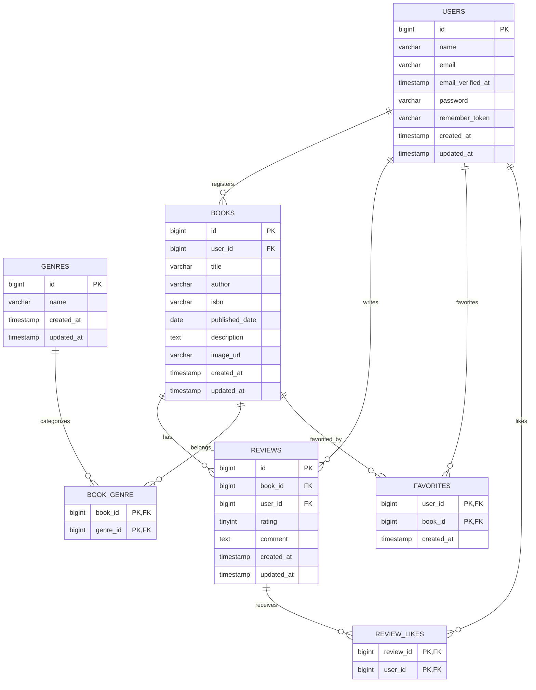

# データベース設計

## usersテーブル

| カラム名 | 型 | PRIMARY KEY | NOT NULL | FOREIGN KEY | 補足 |
|----------|----|-------------|-----------|-------------|------|
| id | bigint unsigned | ○ | ○ | | `$table->id()`、Auto Increment、ユーザーID |
| name | varchar(255) | | ○ | | `string('name')`、ユーザー名 |
| email | varchar(255) | | ○ | | `UNIQUE`、`string('email')`、メールアドレス（ログイン用） |
| email_verified_at | timestamp | | | | `nullable()`、`timestamp('email_verified_at')`、メール確認日時 |
| password | varchar(255) | | ○ | | `string('password')`、ハッシュ化されたパスワード |
| remember_token | varchar(100) | | | | `$table->rememberToken()`、NULL許可、ログイン保持トークン |
| created_at | timestamp | | | | `$table->timestamps()`、レコード作成日時 |
| updated_at | timestamp | | | | `$table->timestamps()`、レコード更新日時 |

> **備考**  
> 基本機能版ではFortifyの以下3カラムが追加されるが、応用機能版では不要。
>
> - `two_factor_secret`
> - `two_factor_recovery_codes`
> - `two_factor_confirmed_at`

---

## genresテーブル

| カラム名 | 型 | PRIMARY KEY | NOT NULL | FOREIGN KEY | 補足 |
|----------|----|-------------|-----------|-------------|------|
| id | bigint unsigned | ○ | ○ | | `id()`、Auto Increment、ジャンルID |
| name | varchar(255) | | ○ | | `UNIQUE`、`string('name')`、ジャンル名（一意） |
| created_at | timestamp | | | | `timestamps()`、レコード作成日時 |
| updated_at | timestamp | | | | `timestamps()`、レコード更新日時 |

---

## booksテーブル

| カラム名 | 型 | PRIMARY KEY | NOT NULL | FOREIGN KEY | 補足 |
|----------|----|-------------|-----------|-------------|------|
| id | bigint unsigned | ○ | ○ | | `id()`、Auto Increment、書籍ID |
| user_id | bigint unsigned | | ○ | ○ | `foreignId('user_id')`、登録したユーザーのID |
| title | varchar(255) | | ○ | | `string('title')`、書籍タイトル |
| author | varchar(255) | | ○ | | `string('author')`、著者名 |
| isbn | varchar(13) | | ○ | | `UNIQUE`、`string('isbn', 13)`、ISBN-13コード（一意） |
| published_date | date | | ○ | | `date('published_date')`、出版日 |
| description | text | | ○ | | `text('description')`、書籍の説明文・概要 |
| image_url | varchar(2048) | | ○ | | `string('image_url', 2048)`、書籍画像URL |
| created_at | timestamp | | | | `timestamps()`、レコード作成日時 |
| updated_at | timestamp | | | | `timestamps()`、レコード更新日時 |

---

## book_genreテーブル

| カラム名 | 型 | PRIMARY KEY | NOT NULL | FOREIGN KEY | 補足 |
|----------|----|-------------|-----------|-------------|------|
| book_id | bigint unsigned | ○ | ○ | ○ | `foreignId('book_id')`、書籍ID |
| genre_id | bigint unsigned | ○ | ○ | ○ | `foreignId('genre_id')`、ジャンルID |

**複合主キー:** `(book_id, genre_id)`

---

## reviewsテーブル

| カラム名 | 型 | PRIMARY KEY | NOT NULL | FOREIGN KEY | 補足 |
|----------|----|-------------|-----------|-------------|------|
| id | bigint unsigned | ○ | ○ | | `id()`、レビューID |
| book_id | bigint unsigned | | ○ | ○ | `foreignId('book_id')`、レビュー対象の書籍ID |
| user_id | bigint unsigned | | ○ | ○ | `foreignId('user_id')`、投稿したユーザーのID |
| rating | tinyint unsigned | | ○ | | `unsignedTinyInteger('rating')`、星評価（1〜5） |
| comment | text | | ○ | | `text('comment')`、レビュー本文 |
| created_at | timestamp | | | | `timestamps()`、レコード作成日時 |
| updated_at | timestamp | | | | `timestamps()`、レコード更新日時 |

---

## favoritesテーブル

| カラム名 | 型 | PRIMARY KEY | NOT NULL | FOREIGN KEY | 補足 |
|----------|----|-------------|-----------|-------------|------|
| user_id | bigint unsigned | ○ | ○ | ○ | `foreignId('user_id')`、ユーザーID |
| book_id | bigint unsigned | ○ | ○ | ○ | `foreignId('book_id')`、書籍ID |
| created_at | timestamp | | ○ | | `timestamps()`、お気に入り登録日時 |

**複合主キー:** `(user_id, book_id)`

---

## review_likesテーブル

| カラム名 | 型 | PRIMARY KEY | NOT NULL | FOREIGN KEY | 補足 |
|----------|----|-------------|-----------|-------------|------|
| review_id | bigint unsigned | ○ | ○ | ○ | `foreignId('review_id')`、レビューID |
| user_id | bigint unsigned | ○ | ○ | ○ | `foreignId('user_id')`、ユーザーID |

**複合主キー:** `(review_id, user_id)`

