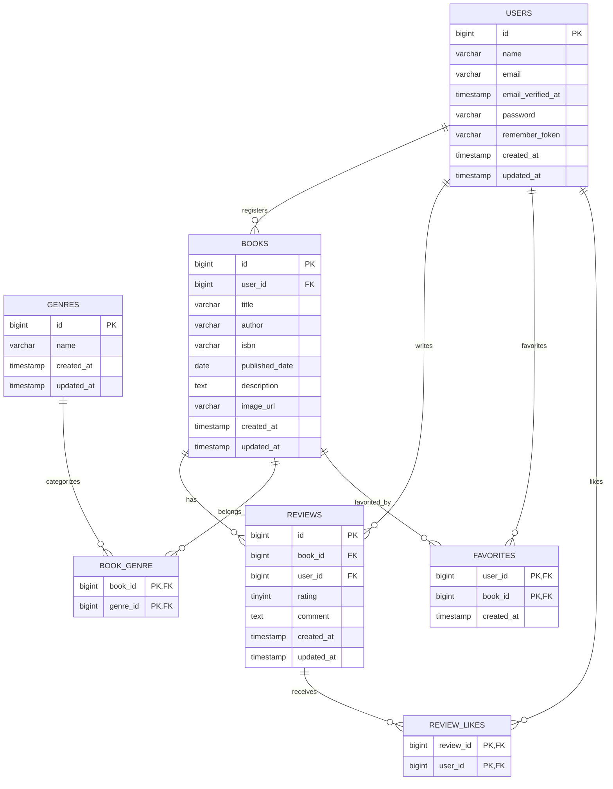

```mermaid
erDiagram

    USERS {
        bigint id PK
        varchar name
        varchar email
        timestamp email_verified_at
        varchar password
        varchar remember_token
        timestamp created_at
        timestamp updated_at
    }

    GENRES {
        bigint id PK
        varchar name
        timestamp created_at
        timestamp updated_at
    }

    BOOKS {
        bigint id PK
        bigint user_id FK
        varchar title
        varchar author
        varchar isbn
        date published_date
        text description
        varchar image_url
        timestamp created_at
        timestamp updated_at
    }

    REVIEWS {
        bigint id PK
        bigint book_id FK
        bigint user_id FK
        tinyint rating
        text comment
        timestamp created_at
        timestamp updated_at
    }

    BOOK_GENRE {
        bigint book_id PK,FK
        bigint genre_id PK,FK
    }

    FAVORITES {
        bigint user_id PK,FK
        bigint book_id PK,FK
        timestamp created_at
    }

    REVIEW_LIKES {
        bigint review_id PK,FK
        bigint user_id PK,FK
    }

    USERS ||--o{ BOOKS : registers
    USERS ||--o{ REVIEWS : writes
    USERS ||--o{ FAVORITES : favorites
    USERS ||--o{ REVIEW_LIKES : likes

    BOOKS ||--o{ REVIEWS : has
    BOOKS ||--o{ BOOK_GENRE : belongs_to
    GENRES ||--o{ BOOK_GENRE : categorizes

    BOOKS ||--o{ FAVORITES : favorited_by
    REVIEWS ||--o{ REVIEW_LIKES : receives
```
