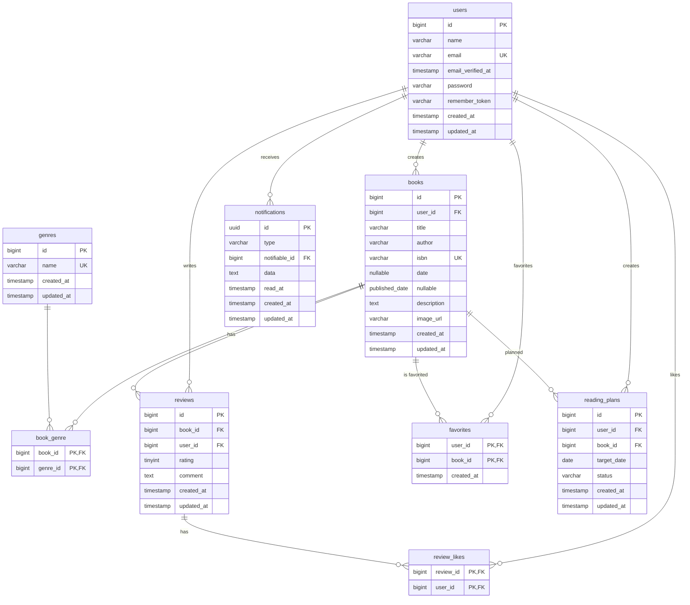

# ER図

## 補足

- `book_genre`、`favorites`、`review_likes` は複合主キーを持つ中間テーブルです。
- `books.isbn` および `books.published_date` は `NULL` を許可しています。
- `notifications` は Laravel 標準の通知テーブルを利用しています。ER図では受信ユーザーとの関連のみを表しています。