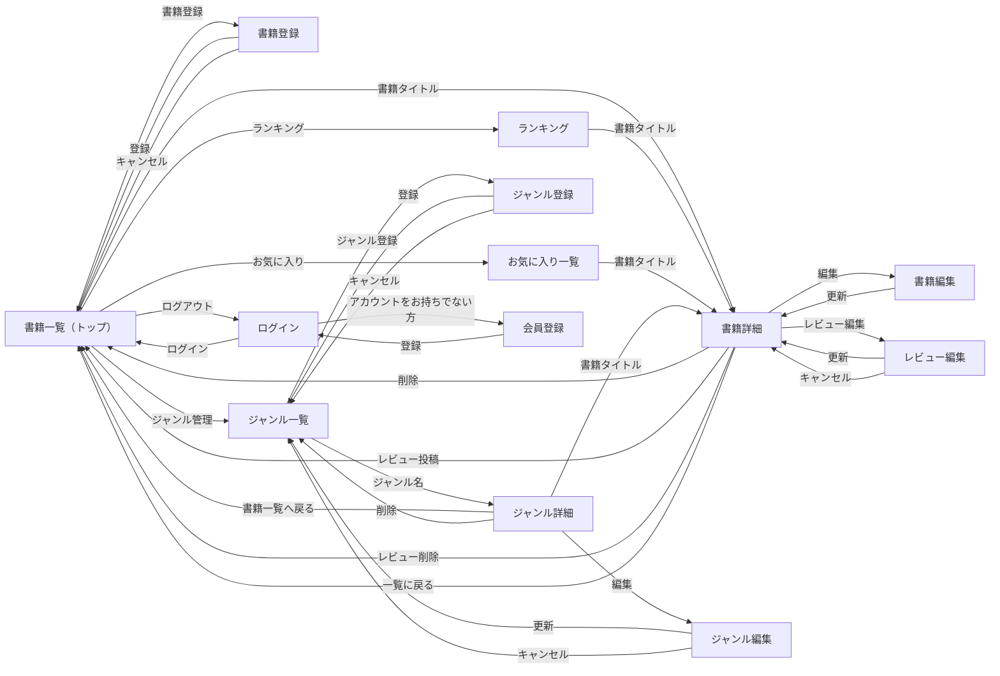

# 書籍管理システム 画面遷移図

## 遷移時メッセージ

| 操作 | 結果 |
|------|------|
| 書籍更新 | 「書籍を編集しました」→ 書籍詳細 |
| 書籍削除 | 「書籍を削除しました」→ トップ |
| レビュー投稿 | 「レビューを投稿しました」→ トップ |
| レビュー更新 | 「レビューを更新しました」→ 書籍詳細 |
| レビュー削除 | 「レビューを削除しました」→ トップ |
| 書籍登録 | 「書籍を登録しました」→ トップ |
| ジャンル登録 | 「ジャンルを登録しました」→ ジャンル一覧 |
| ジャンル更新 | 「ジャンル名を更新しました」→ ジャンル一覧 |
| ジャンル削除 | 「書籍を削除しました」→ ジャンル一覧 |
| 会員登録 | 「会員登録が完了しました。ログインしてください。」→ ログイン画面 |

## 備考

- 未認証で書籍登録を実行した場合はログイン画面へリダイレクト
- キャンセルボタンは元画面へ戻る
- ランキング・お気に入り・ジャンル詳細の書籍タイトルから書籍詳細へ遷移
