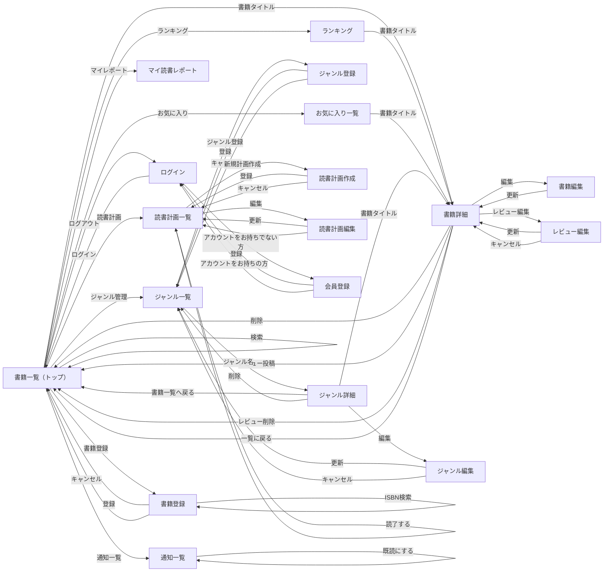

# 書籍管理システム 画面遷移図

```mermaid
flowchart LR

TOP[書籍一覧（トップ）]
DETAIL[書籍詳細]
EDIT[書籍編集]
BOOK_NEW[書籍登録]
REVIEW_EDIT[レビュー編集]

RANK[ランキング]
FAVORITE[お気に入り一覧]

GENRE_LIST[ジャンル一覧]
GENRE_NEW[ジャンル登録]
GENRE_DETAIL[ジャンル詳細]
GENRE_EDIT[ジャンル編集]

REPORT[マイ読書レポート]

PLAN_LIST[読書計画一覧]
PLAN_NEW[読書計画作成]
PLAN_EDIT[読書計画編集]

NOTICE[通知一覧]

LOGIN[ログイン]
REGISTER[会員登録]

%% 書籍
TOP -->|書籍タイトル| DETAIL
DETAIL -->|編集| EDIT
EDIT -->|更新| DETAIL
DETAIL -->|削除| TOP

%% レビュー
DETAIL -->|レビュー投稿| TOP
DETAIL -->|レビュー編集| REVIEW_EDIT
REVIEW_EDIT -->|更新| DETAIL
REVIEW_EDIT -->|キャンセル| DETAIL
DETAIL -->|レビュー削除| TOP

DETAIL -->|一覧に戻る| TOP

%% 書籍登録
TOP -->|書籍登録| BOOK_NEW
BOOK_NEW -->|ISBN検索| BOOK_NEW
BOOK_NEW -->|登録| TOP
BOOK_NEW -->|キャンセル| TOP

%% ランキング
TOP -->|ランキング| RANK
RANK -->|書籍タイトル| DETAIL

%% お気に入り
TOP -->|お気に入り| FAVORITE
FAVORITE -->|書籍タイトル| DETAIL

%% ジャンル
TOP -->|ジャンル管理| GENRE_LIST
GENRE_LIST -->|ジャンル登録| GENRE_NEW
GENRE_NEW -->|登録| GENRE_LIST
GENRE_NEW -->|キャンセル| GENRE_LIST

GENRE_LIST -->|ジャンル名| GENRE_DETAIL
GENRE_DETAIL -->|書籍一覧へ戻る| TOP
GENRE_DETAIL -->|書籍タイトル| DETAIL
GENRE_DETAIL -->|編集| GENRE_EDIT
GENRE_EDIT -->|更新| GENRE_LIST
GENRE_EDIT -->|キャンセル| GENRE_LIST
GENRE_DETAIL -->|削除| GENRE_LIST

%% 検索
TOP -->|検索| TOP

%% マイ読書レポート
TOP -->|マイレポート| REPORT

%% 読書計画
TOP -->|読書計画| PLAN_LIST
PLAN_LIST -->|新規計画作成| PLAN_NEW
PLAN_NEW -->|登録| PLAN_LIST
PLAN_NEW -->|キャンセル| PLAN_LIST

PLAN_LIST -->|編集| PLAN_EDIT
PLAN_EDIT -->|更新| PLAN_LIST
PLAN_EDIT -->|キャンセル| PLAN_LIST

PLAN_LIST -->|削除| PLAN_LIST
PLAN_LIST -->|読了する| PLAN_LIST

%% 通知
TOP -->|通知一覧| NOTICE
NOTICE -->|既読にする| NOTICE

%% 認証
TOP -->|ログアウト| LOGIN
LOGIN -->|ログイン| TOP
LOGIN -->|アカウントをお持ちでない方| REGISTER
REGISTER -->|登録| LOGIN
REGISTER -->|アカウントをお持ちの方| LOGIN
```

## 遷移時メッセージ

| 操作 | 結果 |
|------|------|
| 書籍更新 | 「書籍を編集しました」→ 書籍詳細 |
| 書籍削除 | 「書籍を削除しました」→ トップ |
| レビュー投稿 | 「レビューを投稿しました」→ トップ |
| レビュー更新 | 「レビューを更新しました」→ 書籍詳細 |
| レビュー削除 | 「レビューを削除しました」→ トップ |
| 書籍登録 | 「書籍を登録しました」→ トップ |
| ISBN検索（成功） | APIから書籍情報を自動入力 |
| ISBN検索（失敗） | 「該当する書籍が見つかりませんでした」表示 |
| ジャンル登録 | 「ジャンルを登録しました」→ ジャンル一覧 |
| ジャンル更新 | 「ジャンル名を更新しました」→ ジャンル一覧 |
| ジャンル削除 | 「書籍を削除しました」→ ジャンル一覧 |
| 読書計画削除 | 「削除しました」→ 読書計画一覧 |
| 会員登録 | 「会員登録が完了しました。ログインしてください。」→ ログイン画面 |

## 備考

- 未認証で書籍登録を実行した場合はログイン画面へリダイレクト
- ISBN検索成功時はGoogle Books API等から取得した書籍情報をフォームへ自動入力する
- ISBN検索失敗時は「該当する書籍が見つかりませんでした」を表示し、登録画面に留まる
- キャンセルボタンは元画面へ戻る
- ランキング・お気に入り・ジャンル詳細の書籍タイトルから書籍詳細へ遷移
- キーワード・ジャンル・並び順を指定して検索すると、書籍一覧を再表示する
- 通知の「既読にする」は通知一覧画面を更新する
- 「読了する」は読書計画一覧内で状態を「読了」に更新する
